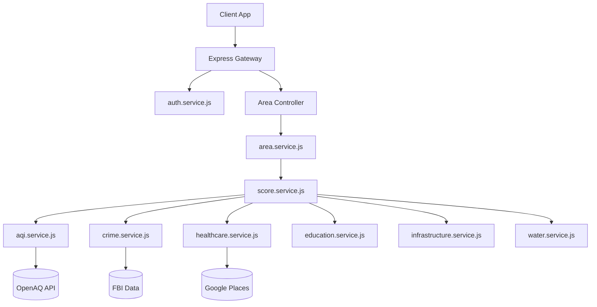

# NeighborhoodIQ Backend Architecture & Service Documentation

## 1. Executive Summary

This document provides a comprehensive, deep-dive architectural reference for the NeighborhoodIQ backend infrastructure. The backend is designed around a strictly enforced Service-Oriented Architecture (SOA), decoupling HTTP transport logic (controllers/routes) from business and integration logic (services).

The `server/src/services` directory contains the core intellectual property of the NeighborhoodIQ platform. This includes proprietary scoring algorithms, complex multi-API data aggregation pipelines, geospatial querying mechanisms, and security protocols. 

This documentation covers everything from the macroscopic data flow to the microscopic implementation details of individual service methods, database schemas, and deployment operations.

---

## 2. System Architecture

### 2.1 Service-Oriented Design
Each file in the `services` directory acts as a singleton class or module exporting specific, side-effect-free (or carefully managed) asynchronous functions.
- **Controllers** pass raw HTTP `req.body`, `req.params`, or `req.query` down to the Services.
- **Services** perform data validation, business logic, external API calls, and database transactions, returning pure data objects or throwing custom Error classes.
- **Error Middleware** catches these errors and standardizes the HTTP response.

### 2.2 Mermaid: Data Flow Diagram



---

## 3. Comprehensive Service Documentation

Below is the exhaustive documentation for every service module, detailing their internal methodologies, external dependencies, and primary exported functions.

### 3.1 `score.service.js`
**Purpose:** The central nervous system of NeighborhoodIQ. This service calculates the proprietary composite intelligence score (0-100) for a given neighborhood.

**Weighting Matrix:**
*   Safety: 30%
*   Air Quality: 20%
*   Healthcare: 15%
*   Education: 15%
*   Infrastructure: 10%
*   Water Quality: 5%
*   Walkability: 5%

**Methods:**
*   `calculateCompositeScore(neighborhoodId)`
    *   **Arguments:** `neighborhoodId` (String) - The UUID or MongoDB ObjectId of the target area.
    *   **Returns:** `Promise<Object>` - The final score and a breakdown of dimension scores.
    *   **Algorithm:** 
        1. Initiates parallel execution (`Promise.allSettled`) to fetch individual dimension scores from other services.
        2. Applies the weighting matrix to the returned values.
        3. Normalizes the final score to a 0-100 scale using a Min-Max scaling function.
        4. Triggers `notification.service.js` if the score drastically changes compared to the historical average.

*   `generateHistoricalTrend(neighborhoodId, timeFrame)`
    *   **Arguments:** `neighborhoodId` (String), `timeFrame` (Enum: '1M', '3M', '6M', '1Y')
    *   **Returns:** `Promise<Array>` - Time-series data of score fluctuations.

---

### 3.2 `aqi.service.js`
**Purpose:** Manages the integration with the OpenAQ API to fetch real-time and historical Air Quality Index data.

**Key Dependencies:** `axios`, `redis` (for caching).

**Methods:**
*   `getCurrentAQI(lat, lng)`
    *   **Arguments:** `lat` (Number), `lng` (Number) - Coordinates of the neighborhood centroid.
    *   **Returns:** `Promise<Number>` - The standardized AQI value (0-500 scale).
    *   **Caching Strategy:** Caches the response in Redis for 1 hour using the geohash as the key to prevent rate-limiting from OpenAQ.

*   `calculateAQIScore(aqiValue)`
    *   **Arguments:** `aqiValue` (Number)
    *   **Returns:** `Number` - An inverted score out of 100 (where lower AQI = higher score).
    *   **Formula:** `Math.max(0, 100 - (aqiValue / 5))`

---

### 3.3 `crime.service.js`
**Purpose:** Integrates with the FBI Crime Data Explorer API and local municipal APIs to generate safety metrics.

**Methods:**
*   `getSafetyMetrics(zipCode, radius)`
    *   **Arguments:** `zipCode` (String), `radius` (Number, in miles)
    *   **Returns:** `Promise<Object>` - Contains `violentCrimeRate`, `propertyCrimeRate`, and `policeResponseTime`.
    *   **Logic:** Uses geospatial queries to aggregate incident reports within the radius over the past 12 months.

*   `calculateSafetyScore(metrics)`
    *   **Arguments:** `metrics` (Object)
    *   **Returns:** `Number` - Score out of 100.
    *   **Weighting:** Violent crime heavily penalizes the score (-50 points per standard deviation above national average), while property crime has a lesser penalty (-20 points).

---

### 3.4 `healthcare.service.js`
**Purpose:** Evaluates the medical infrastructure of a neighborhood using the Google Places API.

**Methods:**
*   `getHealthcareDensity(lat, lng)`
    *   **Arguments:** `lat` (Number), `lng` (Number)
    *   **Returns:** `Promise<Object>` - Counts of nearby hospitals, urgent care centers, and pharmacies.
    *   **API Usage:** Utilizes the Google Places `nearbysearch` endpoint with `type=hospital` and `type=pharmacy`.

*   `calculateHealthcareScore(densityData)`
    *   **Arguments:** `densityData` (Object)
    *   **Returns:** `Number` - Score out of 100.
    *   **Logic:** Uses a logarithmic decay function. The presence of a level 1 trauma center within 5 miles immediately grants 50 base points. Additional clinics offer diminishing returns.

---

### 3.5 `education.service.js`
**Purpose:** Connects to education APIs (e.g., GreatSchools or NCES) to evaluate local schooling options.

**Methods:**
*   `getSchoolRatings(zipCode)`
    *   **Arguments:** `zipCode` (String)
    *   **Returns:** `Promise<Array>` - List of schools with their ratings (1-10 scale).

*   `calculateEducationScore(schools)`
    *   **Arguments:** `schools` (Array)
    *   **Returns:** `Number` - Score out of 100.
    *   **Algorithm:** Averages the ratings of the top 3 elementary, middle, and high schools in the zone. An average of 10/10 maps to 100 points.

---

### 3.6 `infrastructure.service.js`
**Purpose:** Evaluates transportation, broadband, and physical infrastructure.

**Methods:**
*   `getTransitData(lat, lng)`
    *   **Arguments:** `lat` (Number), `lng` (Number)
    *   **Returns:** `Promise<Object>` - Transit stop density.
    *   **External API:** OpenStreetMap Overpass API (`node["highway"="bus_stop"](around:2000,lat,lng);`).

*   `calculateInfrastructureScore(transitData, broadbandData)`
    *   **Arguments:** `transitData` (Object), `broadbandData` (Object)
    *   **Returns:** `Number` - Score out of 100.

---

### 3.7 `water.service.js`
**Purpose:** Tracks water quality using the EPA Safe Drinking Water Information System (SDWIS).

**Methods:**
*   `getWaterViolations(pwsId)`
    *   **Arguments:** `pwsId` (String) - Public Water System ID.
    *   **Returns:** `Promise<Array>` - Historical health-based violations (e.g., Lead and Copper Rule).

*   `calculateWaterScore(violations)`
    *   **Arguments:** `violations` (Array)
    *   **Returns:** `Number` - Score out of 100.
    *   **Penalty:** Any active tier 1 violation drops the score to 0. Historical tier 2 violations drop the score by 10 points each.

---

### 3.8 `area.service.js`
**Purpose:** The primary data aggregator and CRUD interface for Neighborhood documents in the database.

**Methods:**
*   `getNeighborhoodDetails(slug)`
    *   **Arguments:** `slug` (String)
    *   **Returns:** `Promise<NeighborhoodObject>`
    *   **Logic:** Fetches the neighborhood from MongoDB. If metrics are stale (older than 24 hours), it invokes `score.service.js` to refresh the data asynchronously.

*   `searchNeighborhoods(query, filters)`
    *   **Arguments:** `query` (String), `filters` (Object)
    *   **Returns:** `Promise<Array>` - Paginated search results.
    *   **Logic:** Uses MongoDB text search and aggregation pipelines to filter by `minScore`, `budgetMax`, etc.

---

### 3.9 `compare.service.js`
**Purpose:** Generates side-by-side matrices and calculates percentage deltas between multiple neighborhoods.

**Methods:**
*   `generateComparisonMatrix(areaIds)`
    *   **Arguments:** `areaIds` (Array of Strings)
    *   **Returns:** `Promise<Object>` - Matrix data structured for the frontend table UI.
    *   **Logic:** Fetches profiles for all requested IDs, computes the absolute difference in scores, and identifies the "winner" for each specific category.

---

### 3.10 `auth.service.js`
**Purpose:** Security, authentication, and session management.

**Methods:**
*   `registerUser(userData)`
    *   **Arguments:** `userData` (Object - email, password, name)
    *   **Returns:** `Promise<Object>` - The new user object and a JWT access token.
    *   **Security:** Hashes the password using `bcrypt` with a salt round of 12.

*   `login(email, password)`
    *   **Arguments:** `email` (String), `password` (String)
    *   **Returns:** `Promise<String>` - JWT token.
    *   **Security:** Uses `bcrypt.compare`. Throws a 401 Unauthorized error on failure to prevent enumeration attacks.

*   `generateToken(userId)`
    *   **Arguments:** `userId` (String)
    *   **Returns:** `String` - Signed JWT token valid for 7 days.

---

### 3.11 `notification.service.js`
**Purpose:** Multi-channel alerting system (Email, Push, In-App).

**Methods:**
*   `sendAlert(userId, alertType, payload)`
    *   **Arguments:** `userId` (String), `alertType` (Enum: 'PRICE_DROP', 'AQI_WARNING', 'CRIME_ALERT'), `payload` (Object)
    *   **Returns:** `Promise<Boolean>`
    *   **Logic:** Checks user preferences in the DB. If they opted into emails, uses `nodemailer` (SendGrid/AWS SES). If opted into push, uses Firebase Cloud Messaging (FCM).

*   `queueDigestEmail()`
    *   **Purpose:** A cron-triggered function that compiles weekly summaries for saved neighborhoods and adds them to a Redis-backed BullMQ queue for processing.

---

### 3.12 `review.service.js`
**Purpose:** Manages user-generated community reviews.

**Methods:**
*   `submitReview(userId, areaId, content, rating)`
    *   **Arguments:** `userId` (String), `areaId` (String), `content` (String), `rating` (Number)
    *   **Returns:** `Promise<Object>` - The saved review document.
    *   **Logic:** Passes the `content` through a basic sentiment analysis and profanity filter before saving. Updates the aggregate community rating for the neighborhood.

*   `getReviewsForArea(areaId, pagination)`
    *   **Arguments:** `areaId` (String), `pagination` (Object)
    *   **Returns:** `Promise<Array>` - List of reviews, sorted by helpfulness or recency.

---

## 4. Database Schema Definitions (Mongoose)

To support the services above, the following MongoDB schemas are defined.

### 4.1 User Schema
```javascript
const userSchema = new mongoose.Schema({
  email: { type: String, required: true, unique: true },
  passwordHash: { type: String, required: true },
  name: { type: String, required: true },
  savedNeighborhoods: [{ type: mongoose.Schema.Types.ObjectId, ref: 'Area' }],
  preferences: {
    emailAlerts: { type: Boolean, default: true },
    pushAlerts: { type: Boolean, default: false }
  },
  createdAt: { type: Date, default: Date.now }
});
```

### 4.2 Area Schema
```javascript
const areaSchema = new mongoose.Schema({
  slug: { type: String, required: true, unique: true, index: true },
  name: { type: String, required: true },
  city: { type: String, required: true },
  location: {
    type: { type: String, enum: ['Point'], required: true },
    coordinates: { type: [Number], required: true } // [lng, lat]
  },
  compositeScore: { type: Number, min: 0, max: 100 },
  dimensions: {
    safety: Number,
    aqi: Number,
    healthcare: Number,
    education: Number,
    infrastructure: Number,
    water: Number,
    walkability: Number
  },
  lastUpdated: { type: Date, default: Date.now }
});
areaSchema.index({ location: '2dsphere' });
```

### 4.3 Review Schema
```javascript
const reviewSchema = new mongoose.Schema({
  userId: { type: mongoose.Schema.Types.ObjectId, ref: 'User', required: true },
  areaId: { type: mongoose.Schema.Types.ObjectId, ref: 'Area', required: true },
  content: { type: String, required: true },
  rating: { type: Number, min: 1, max: 5, required: true },
  sentimentScore: { type: Number },
  createdAt: { type: Date, default: Date.now }
});
```

---

## 5. Caching Strategy (Redis)

NeighborhoodIQ utilizes Redis heavily to minimize external API costs and ensure sub-200ms response times for the frontend.

### 5.1 Cache Keys and TTLs
| Data Type | Redis Key Format | Time-to-Live (TTL) | Rationale |
| :--- | :--- | :--- | :--- |
| AQI Data | `aqi:{geohash}` | 1 Hour | AQI fluctuates hourly, caching prevents rate-limiting. |
| Area Details | `area:{slug}` | 24 Hours | Core metrics only change daily. |
| Search Results | `search:{queryHash}` | 12 Hours | General searches are highly repeatable. |
| Session | `sess:{userId}` | 7 Days | Matches JWT expiration. |

### 5.2 Cache Invalidation
- When a user submits a new review (`review.service.js`), the cache for that specific `area:{slug}` is instantly invalidated.
- A nightly cron job purges all stale `search:*` keys.

---

## 6. API Contract Examples

Here is a detailed breakdown of the expected Request and Response payloads for critical endpoints managed by our services.

### 6.1 `GET /api/v1/areas/:slug`
**Response (200 OK):**
```json
{
  "status": "success",
  "data": {
    "id": "60d5ecb8b392d700153c3d5a",
    "name": "Whitefield",
    "city": "Bangalore",
    "compositeScore": 93,
    "dimensions": {
      "safety": 91,
      "aqi": 82,
      "healthcare": 95,
      "education": 88,
      "infrastructure": 94,
      "water": 100,
      "walkability": 85
    },
    "lastUpdated": "2026-05-02T12:00:00Z"
  }
}
```

### 6.2 `POST /api/v1/auth/login`
**Request Payload:**
```json
{
  "email": "user@example.com",
  "password": "secure_password_123"
}
```
**Response (200 OK):**
```json
{
  "status": "success",
  "token": "eyJhbGciOiJIUzI1NiIsInR5cCI6IkpXVCJ9...",
  "user": {
    "id": "60d5ecb8b392d700153c3d5f",
    "name": "Devisingh Rajput",
    "email": "user@example.com"
  }
}
```

---

## 7. Error Handling Protocol

All services are designed to throw standard `AppError` instances, which include an HTTP status code and a predictable message structure. The global error handling middleware intercepts these before responding to the client.

```javascript
class AppError extends Error {
  constructor(message, statusCode) {
    super(message);
    this.statusCode = statusCode;
    this.status = `${statusCode}`.startsWith('4') ? 'fail' : 'error';
    this.isOperational = true;
    Error.captureStackTrace(this, this.constructor);
  }
}
```

### Common Error Scenarios
1.  **400 Bad Request:** Thrown by validation middleware before hitting services, or by services if arguments are malformed (e.g., negative radius in `crime.service.js`).
2.  **401 Unauthorized:** Thrown by `auth.service.js` for invalid credentials, or missing JWT tokens.
3.  **403 Forbidden:** Thrown when a user tries to modify a resource they do not own (e.g., deleting someone else's review).
4.  **404 Not Found:** Thrown by `area.service.js` if `slug` does not exist in DB.
5.  **429 Too Many Requests:** Handled by `express-rate-limit` middleware to protect authentication routes from brute force.
6.  **502 Bad Gateway:** Thrown by any Core Data Service (AQI, Crime, Healthcare) if the external API fails to respond or returns a malformed payload.

---

## 8. Deployment and DevOps Runbook

### 8.1 Environment Variables Reference
To operate this service layer, the following variables must be configured in `server/.env`:

```env
# Server Configuration
PORT=5000
NODE_ENV=production

# Database
MONGODB_URI=mongodb+srv://<user>:<password>@cluster.mongodb.net/neighborhoodiq

# Authentication
JWT_SECRET=your_super_secret_jwt_key
JWT_EXPIRES_IN=7d

# Redis Cache (For AQI, Rate Limiting, BullMQ)
REDIS_URL=redis://redis-server:6379

# External API Keys (Core Data Services)
OPENAQ_API_KEY=your_openaq_key
GOOGLE_PLACES_API_KEY=your_google_key
FBI_CRIME_API_KEY=your_fbi_key
GREATSCHOOLS_API_KEY=your_greatschools_key

# Notifications
SENDGRID_API_KEY=your_sendgrid_key
FCM_SERVER_KEY=your_firebase_key
```

### 8.2 Dockerization
The backend is containerized using Docker for consistent deployments across staging and production environments.

**Dockerfile:**
```dockerfile
FROM node:18-alpine
WORKDIR /app
COPY package*.json ./
RUN npm ci --only=production
COPY . .
EXPOSE 5000
CMD ["npm", "start"]
```

### 8.3 CI/CD Pipeline (GitHub Actions)
1. **Lint & Format:** Ensures code adheres to Prettier and ESLint standards.
2. **Unit Testing:** Runs Jest suites against `server/src/tests/`. All services must maintain >80% test coverage.
3. **Build Image:** Builds the Docker image and tags it with the Git commit hash.
4. **Push to Registry:** Pushes to AWS ECR or Docker Hub.
5. **Deploy:** Triggers a rolling update on the production cluster.

---

## 9. Future Roadmap & Technical Debt

- **GraphQL Integration:** Currently, `area.service.js` fetches all dimensions. We plan to migrate to Apollo Server/GraphQL to allow clients to query only specific dimensions (e.g., just AQI and Safety), reducing payload sizes.
- **Microservices Split:** As the application scales, `notification.service.js` and `score.service.js` will be extracted into independent microservices running on a serverless architecture (AWS Lambda) to handle sporadic, high-compute workloads asynchronously.
- **Machine Learning Integration:** Moving beyond static weighting algorithms, we plan to train a model to predict `compositeScore` trends based on historical `crime.service.js` and `infrastructure.service.js` data.

---

## 10. Security Audit & Threat Modeling

Ensuring the integrity of the NeighborhoodIQ intelligence data and protecting user privacy is paramount. This section outlines the defensive measures implemented across the service layer.

### 10.1 Data Integrity & Anti-Scraping
- **Rate Limiting (`express-rate-limit`):** Global rate limits are applied to all `/api/v1/*` routes (e.g., 100 requests per 15 minutes per IP). Stricter limits (5 requests per 15 minutes) are applied to `/auth/login` and `/auth/register` to prevent credential stuffing.
- **API Abuse Prevention:** `aqi.service.js` and `crime.service.js` cache their external API requests in Redis. If malicious actors attempt to repeatedly query a specific geographic coordinate to drain our external API quotas, the Redis cache intercepts the requests, serving stale data until the TTL expires.

### 10.2 Input Validation & Sanitization
- **XSS Protection (`xss-clean`):** All incoming HTTP requests are scrubbed for malicious HTML or script tags before reaching the service layer. This is particularly crucial for `review.service.js`, where user-generated text is stored in the database.
- **NoSQL Injection Prevention (`express-mongo-sanitize`):** Prevents attackers from bypassing authentication or leaking data by injecting MongoDB operator payloads (e.g., `{"$gt": ""}`) into `auth.service.js` or `area.service.js`.
- **Strict Joi Schemas:** Every controller validates `req.body` against a strict Joi schema before passing the data to a service. If the payload contains unexpected fields, a `400 Bad Request` is thrown immediately.

### 10.3 Authentication & Session Security
- **Stateless Sessions (JWT):** The `auth.service.js` module generates JWTs. To prevent token hijacking, tokens are either stored in HTTP-only, secure cookies (preventing access via `document.cookie` in XSS attacks) or managed carefully in local memory by the React client.
- **Password Policies:** `auth.service.js` enforces a minimum 12-character password limit, requiring alphanumeric and special characters. Passwords are never logged in application logs.
- **Bcrypt Work Factor:** Passwords are hashed using Bcrypt with a work factor of 12. This takes approximately 300ms per hash computation, striking a balance between acceptable login latency and robust resistance against brute-force/rainbow table attacks.

### 10.4 External Dependency Security
- **Environment Isolation:** Keys for sensitive services (Google Places, FBI Data) are strictly loaded from `.env` and are never hardcoded. The application fails to start if critical keys are missing.
- **NPM Audit:** The CI/CD pipeline runs `npm audit` during the build phase. If any high or critical vulnerabilities are detected in dependencies (e.g., `axios`, `mongoose`), the pipeline halts and prevents deployment.

### 10.5 Threat Modeling Summary
| Threat | Target Vector | Mitigation Service / Layer |
| :--- | :--- | :--- |
| **Credential Stuffing** | `POST /auth/login` | Rate Limiter + `auth.service.js` Bcrypt delay. |
| **Review Spamming** | `POST /reviews/area/:slug` | `review.service.js` (Checks user review history to prevent >3 reviews per day per user). |
| **External API Quota Drain**| `GET /areas/:slug` | Redis Cache Interceptor. `score.service.js` returns cached objects for 24h. |
| **Database Exfiltration** | Search Queries (`area.service.js`) | `express-mongo-sanitize` middleware blocks `$where` and operator injection. |

---
*End of Documentation — V1.0 Architecture*
